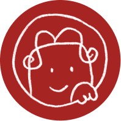
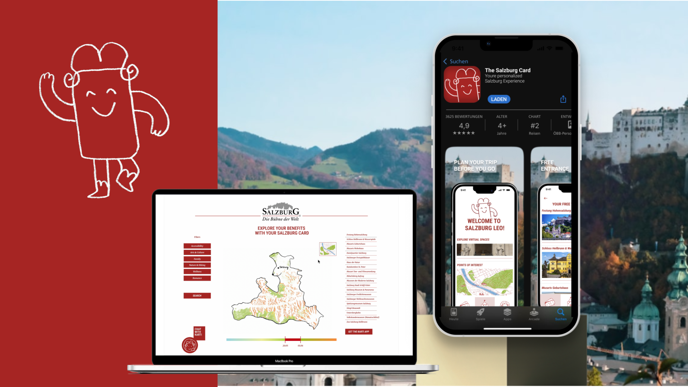

# Salzburg Card - Salzburg tourism hackathon
#  KARTI – Pre-Arrival Card Experience  
**Hackathon: Salzburg Tourism Challenge #3**

> “Your Salzburg experience starts before you arrive.”

---

## 🏰 About the Project


**KARTI** is a digital tourism companion designed to enhance the *Salzburg Card* experience **before** travelers even arrive in the city.

It combines a **website**, a **mobile app**, and a **teaser campaign** to introduce visitors to Salzburg’s cultural life in a playful and interactive way.

KARTI encourages engagement, discovery, and personalization — bridging the gap between anticipation and arrival.

---

## 🌐 Website Overview

The **KARTI Website** serves as the visitor’s *first entry point* into Salzburg.  
It previews exclusive attractions, introduces the mascot **KARTI**, and connects directly to the mobile app.

### 🔹 Key Features
1. **Explore Salzburg Beyond the Walls**  
   - Highlights areas outside the fortress (“Outside Burg”)  
   - Storytelling through visuals and simple interactions  
   - CTA: *“Download KARTI”* to unlock more  

2. **Map with Free Stuff**  
   - Interactive map listing attractions and activities available *free with KARTI*  
   - Filtering and categorization (Museums, Family, Nature, Music...)  
   - Visual marker for “exclusive to KARTI” experiences  

3. **KARTI Chat (Limited Web Demo)**  
   - Chat with KARTI, the friendly Salzburg mascot  
   - Simple Q&A interactions on web  
   - Prompt to continue: *“Want more? Download the KARTI App.”*  

---

## 📱 Mobile App Integration

Once downloaded, the **KARTI App** expands the experience.

### ✨ Features
- 🎫 **Digital vouchers** for museums and attractions  
- 🧭 **Personalized map** with saved routes and recommendations  
- 🎨 **Virtual experiences** (e.g. Mozart’s home, Salzburg Fortress)  
- 🎮 Optional **map-based mini game / VR exploration**  
- 💬 **Full KARTI AI chat assistant** for personalized guidance  

---

## 🎬 Campaign Teaser

A cross-media teaser campaign connects the digital and physical worlds.

### 🧩 Components
- Posters, short videos, and digital ads  
- QR codes placed around Salzburg and partner cities  
- “Scan to meet KARTI” → directs users to website landing page  
- Visual mockups adapted for multiple platforms  

---

## 🌈 Vision

KARTI transforms the waiting period before travel into an *interactive discovery journey*.  
It personalizes tourism, promotes sustainable engagement, and strengthens Salzburg’s identity as a **smart cultural destination**.

> “Explore before you go.  
> Meet Salzburg through KARTI.”

---

## 🧠 Technology & Tools

| Area | Tools |
|------|-------|
| Design & Mockups | Figma / Adobe Creative Suite |
| Website | React / Next.js / TailwindCSS |
| 3D & Interactive | Unity (WebGL or VR export) |
| AI Chat | OpenAI API / KARTI character integration |
| Mapping | Mapbox / Leaflet / custom vector map |
| Campaign Materials | Illustrator, After Effects, QR code links |

---

## 📍 Project Structure


## Installation and Running

1. Install dependencies:
```bash
npm install
```

2. Start development server:
```bash
npm run dev
```

3. Build for production:
```bash
npm run build
```

4. Preview production build:
```bash
npm run preview
```


## Future Plans

- Integrate VR of DOM Salzburg in web (because of the bad weather, we dont have chance this time :/sad)

## our team

## 👥 Team -- VRwhoVR
_A collective of artists, designers, and interactive storytellers._  
Combining creativity, code, and culture to re-imagine digital tourism.

us: 
[https://github.com/

https://github.com/user-attachments/assets/57a8a64f-6faf-4199-8bc7-ab4e8dce6647


